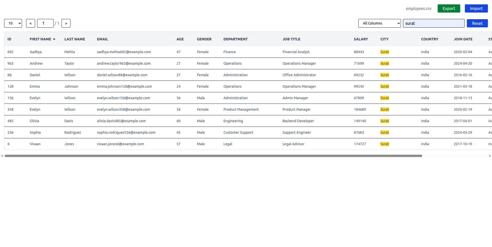

# CSV Data Explorer

A simple **CSV Data Explorer** built with **HTML, JavaScript, and Tailwind CSS**.
It allows users to import CSV files, explore data in a table, sort columns, search values, and paginate results.

## Features

- **Import CSV** file from your system
- **Export data** back to CSV
- **Dynamic table rendering**
- **Column sorting** (ascending / descending)
- **Search & highlight matching text**
- **Pagination** for large datasets

## Tech Stack

- HTML
- JavaScript (Vanilla JS)
- Tailwind CSS

## How It Works

1. Upload a `.csv` file by clicking on the import.
2. The file is read using the **FileReader API**.
3. CSV data is parsed into **JSON objects**.
4. Data is rendered in a **dynamic table**.
5. Users can:

   - Sort columns
   - Search values
   - Navigate pages

